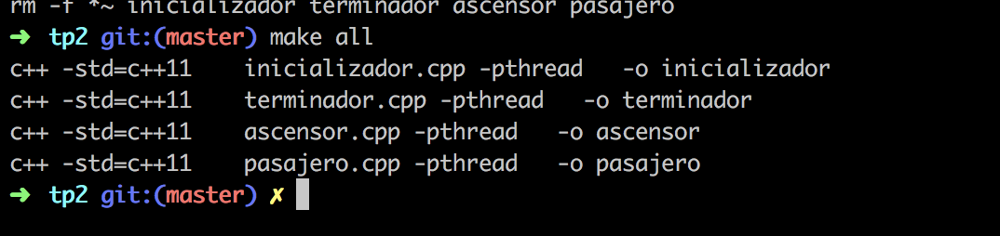
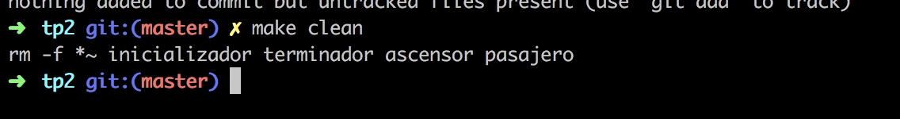
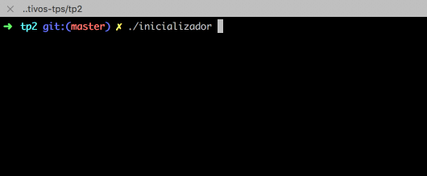
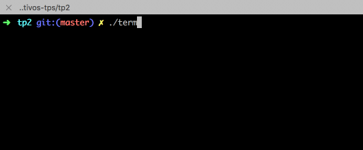
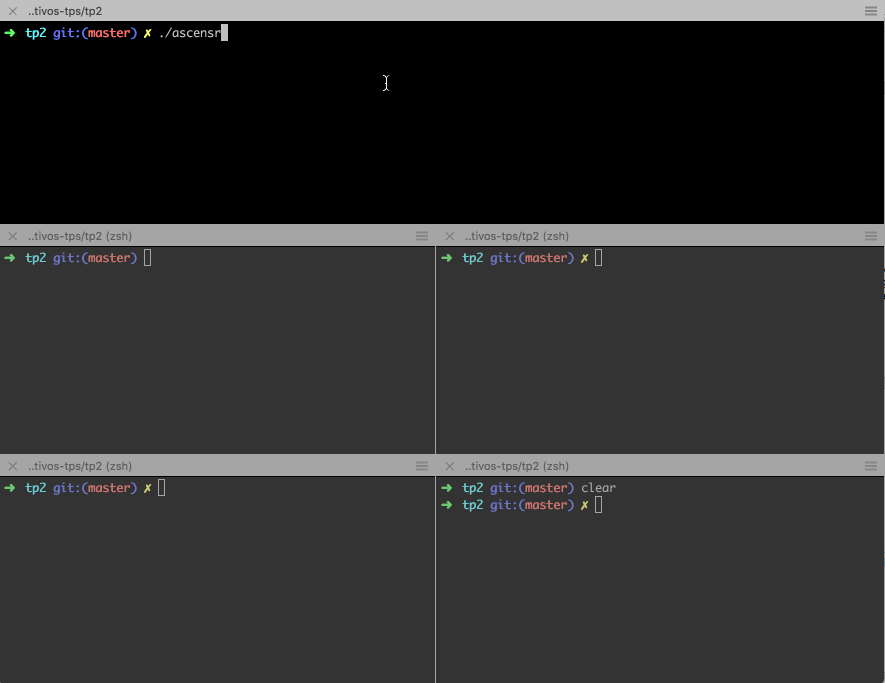

# Trabajo Práctico 2
Documentación del TP 2

- Enunciado: http://materias.fi.uba.ar/7508/2019/2019-1C-TP2-G3.pdf

# Makefile
La entrega cuenta con un makefile que permitira la opción de compilar todos los archivos, como también la opción de eliminar los archivos generados.

## Compilar
Para poder compilar el sistema se debe ejecutar el siguiente comando en la carpeta donde se descargo el codigo fuente.

    $ make all
    

## Limpiar Solución
Para poder limpiar la solución se debe ejecutar el siguiente comando en la carpeta donde se descargo el codigo fuente.

    $ make clean
    

# Ejecución

## Inicializador
Una vez realizada la compilación de los archivos fuentes, se debe realizar la inicialización del sistema. Para ello ejecutar el comando:

    $./inicializador

    
## Terminador
Una vez concluida la ejecución, se cuenta con un Terminador que permite limpiar los semaforos y el area compartida. Para ello ejecutar el comando:
    
    $./terminador

## Ascensor
Para poder ejecutar el ascensor, se deberá ejecutar el siguiente comando:

    $./ascensor

## Pasajero
Para poder ejecutar el proceso del pasajero, debe abrir una nueva terminar de forma paralela a la que está ejecutando el ascensor y ejecutar el siguiente comando:

    $./pasajero NOMBRE PISO_SUBIDA PISO_BAJADA

## Ejecución
A continuación una muestra de una ejecución:

# Descarga
Puede descargar el archivo fuente clonando el repositorio o bien desde el siguiente [enlace](https://github.com/ignamiguel/75-08-sistemas-operativos-tps/raw/master/tp2/trabajo.zip).

